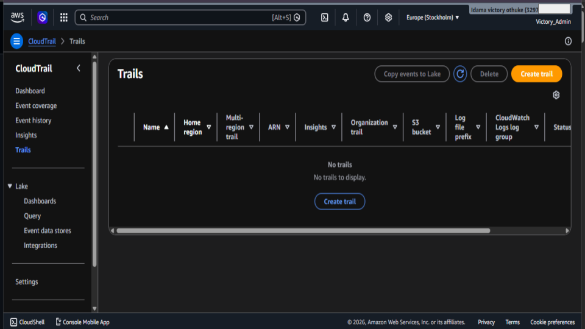
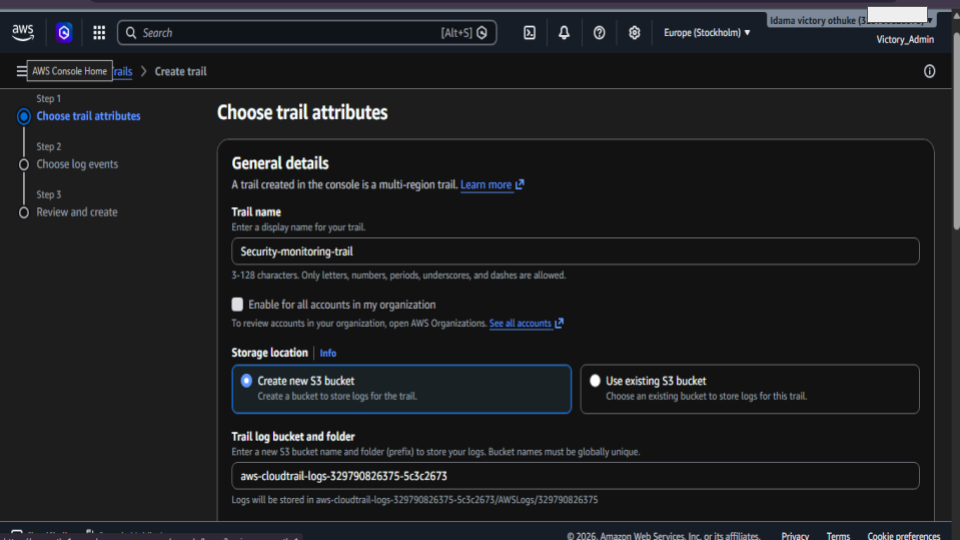
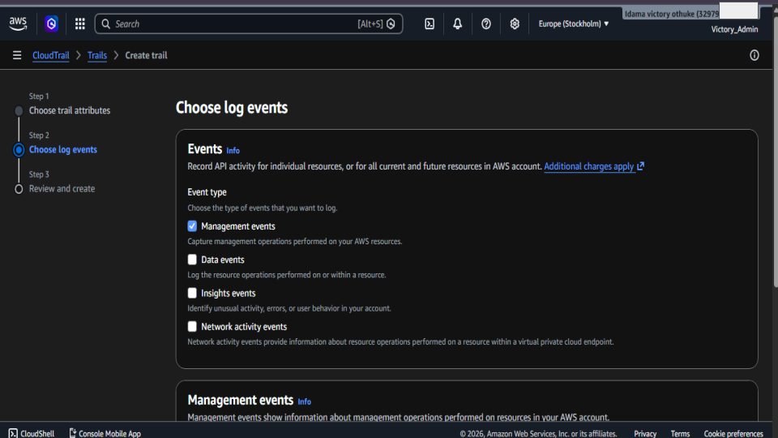
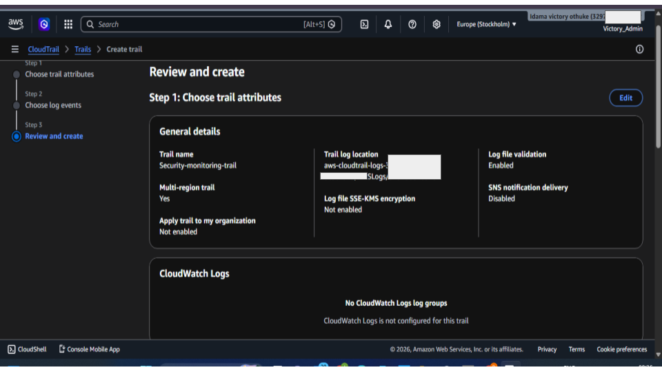
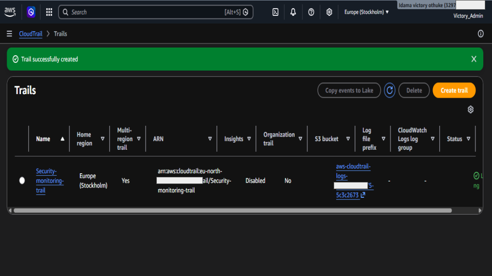
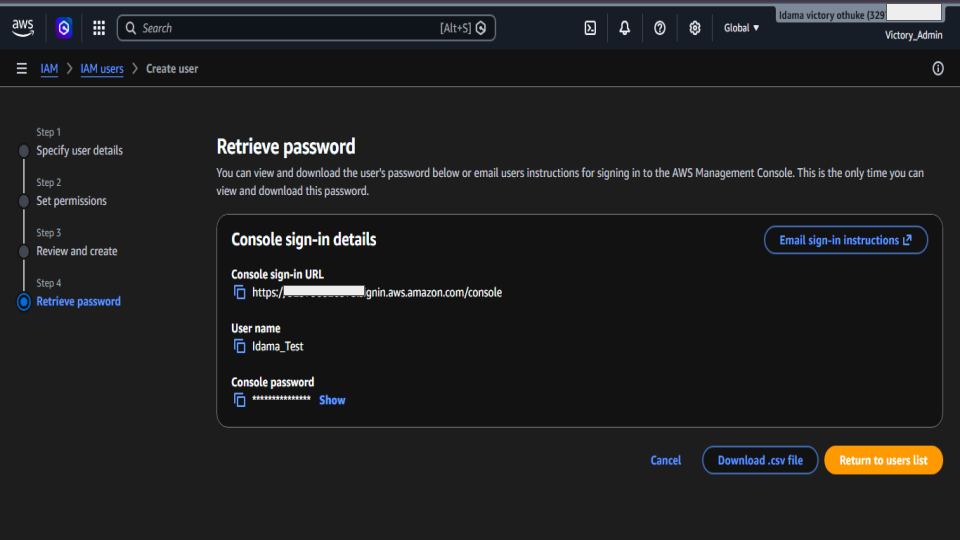
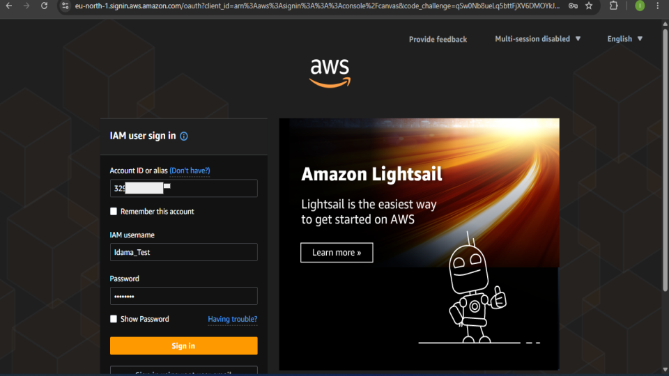
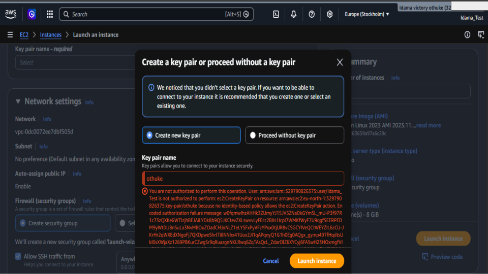
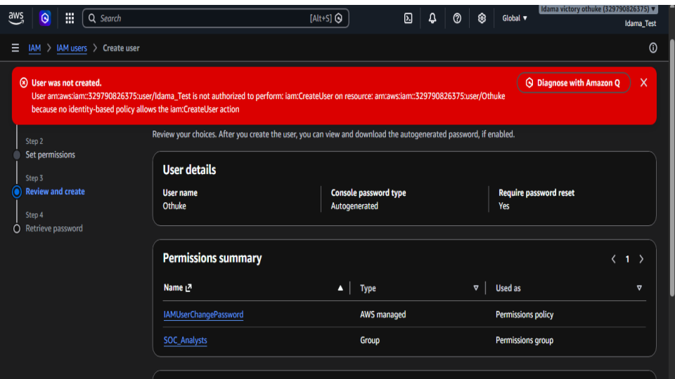
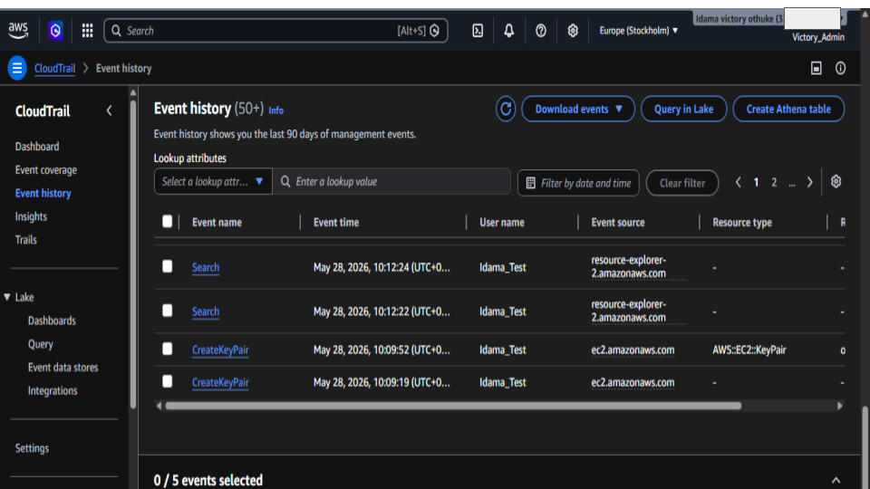

# AWS CloudTrail Monitoring & IAM Permission Investigation Lab

## Project Overview
This project demonstrates how AWS CloudTrail can be used to monitor and investigate user activities within an AWS environment. The lab focuses on IAM user management, failed privilege attempts, and event monitoring using CloudTrail logs.

## Objectives
- Configure AWS CloudTrail for account activity monitoring
- Create and manage IAM users
- Simulate unauthorized actions from a restricted IAM user
- Investigate security events using CloudTrail Event History
- Identify denied actions and suspicious activity attempts

## Technologies Used
- AWS IAM
- AWS CloudTrail
- Amazon EC2
- AWS Management Console

## Key Activities Performed
- Created a multi-region CloudTrail trail
- Enabled management event logging
- Created IAM users with restricted permissions
- Attempted unauthorized EC2 key pair creation
- Investigated failed actions through CloudTrail Event History
- Analyzed event details including:
  - Username
  - Source IP Address
  - Event Name
  - Error Code
  - AWS Region

## Security Findings
The investigation showed how AWS CloudTrail records both successful and failed actions. Unauthorized operations generated `Client.UnauthorizedOperation` errors, while CloudTrail event details revealed important investigation data such as source IP addresses, usernames, event names, and affected AWS resources.

## Skills Demonstrated
- Cloud Security Monitoring
- IAM Administration
- Event Log Investigation
- AWS Security Operations
- Incident Analysis
- Access Control Validation

### 📊 Evidence 

<h4 align="center">In this step, I navigated to the AWS CloudTrail Trails section to verify whether any trails were already configured in the AWS account</h4>

    

<h4 align="center">In this step, I created a new AWS CloudTrail trail named Security-monitoring-trail.

</h4>

    

<h4 align="center">In this step, I configured the type of events that AWS CloudTrail should monitor and record.</h4>

    

<h4 align="center">In this step, I reviewed the final CloudTrail configuration before creating the monitoring trail</h4>

    

<h4 align="center">In this step, the AWS CloudTrail trail was successfully created and became active for monitoring account activities</h4>

    

<h4 align="center">In this step, the IAM user account named Idama_Test was successfully created, and AWS generated the login credentials for the new user</h4>

    

<h4 align="center">In this step, the newly created IAM user named Idama_Test attempts to sign in to the AWS Management Console using the credentials provided by the administrator.</h4>

    

<h4 align="center">In this step, the IAM user Idama_Test attempted to create a new EC2 key pair while launching an EC2 instance</h4>

    

<h4 align="center">In this step, the IAM user Idama_Test attempted to create a new IAM user (Othuke) account within the AWS environment.</h4>

    

<h4 align="center">In this final step, the CloudTrail Event History dashboard was used to investigate activities performed within the AWS accountt</h4>

    

All screenshots are here:

🔗 [Google Slides](https://docs.google.com/presentation/d/123YJL2IIDYIKmkMBw4SAt7TUgnfwgCJouyVXzfxWrPY/edit?usp=sharing)

> Note: Sensitive account information was blurred for security purposes before publication.

## Author
Idama Victory Othuke
